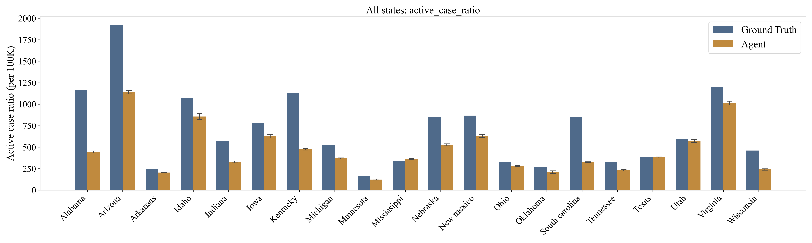
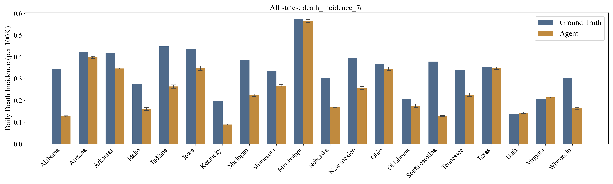
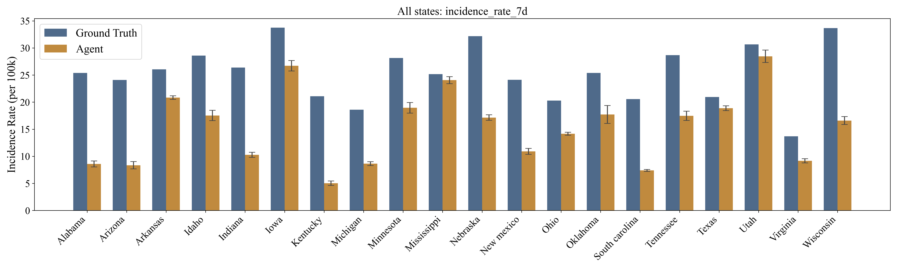
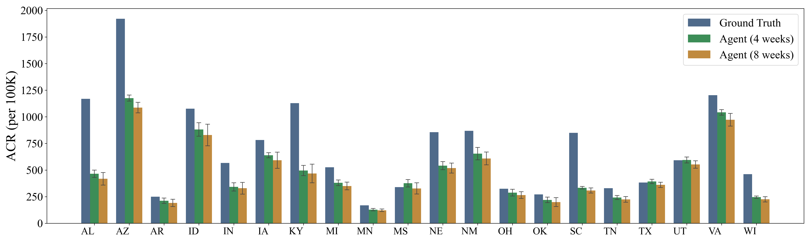
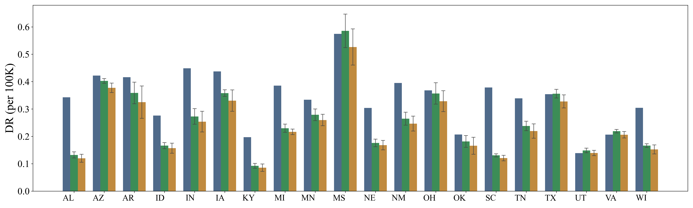
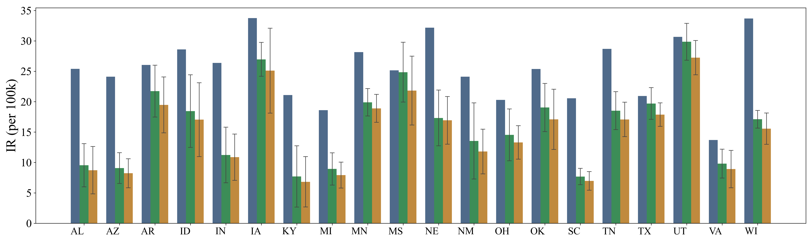
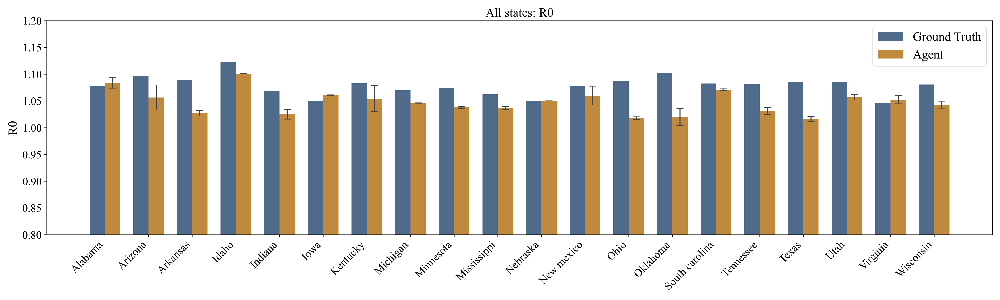

###  Codes explanation
for 5 states:

fitting the parameters:  first stage, datasets/fit_serid_initial_2.ipynb; second stage fit_param_v2.py

calculate metrics after policy: indicator_collect.py

performance visulize: calculate_R0_std.py (含有误差线),  calculate_R0.py， compare_weeks.py (对比week freq下的结果)

compare_rule.py compare_rule_2.py for compare with the random, rule-based and ground truth

plot_R0.py visulize the dynamic Rt (可再生数)

for 20 states:
alabama','arizona', 'arkansas','idaho','indiana', 'iowa', 'kentucky', 'michigan','minnesota', 'mississippi', 'nebraska','new mexico','ohio','oklahoma','south carolina', 'tennessee', 'texas', 'utah','virginia','wisconsin'

fitting the parameters:  first stage, datasets/US/fit_seird_us_1.py; second stage, fit_seird_us_2.1.py

calculate metrics: indicator_collect.py

analysis: analysis/compare_us.ipynb
compare_us_1.py: 20个州 柱状图，不同州感染人数/死亡人数柱状图对比
compare_us_4.py: 20个州TIR(4 weeks 8 weeks), SIS, TIS 折线图带预测 
compare_us_4_individual.py 20个州单独的记过 折线图 同上
calculate_R0.py     计算各个州的R0

plot:
plot_type_classify.py: 5个州 柱状图 绘制不同政策类型（stirct first or balanced）分布
plot_type_regression.py: 5个州 shapely 不同政策类型的特征回归分析

compare_policy_type_2.py: 5个州 infection/deaths comparision with different states 柱状图
compare_policy_type_3.py  5个州 total reduction/equity trade-off 气泡图

compare_week.py:   5个州individual IR, ACR, DR 的折线图
compare_week_2.py:  5个州individual total reduction 柱状图
compare_week_3.py:  5个州之和 （IR, ACR, DR 的折线图）
compare_week_4.py:  5个州之和 （total reduction  的柱状图）

plot_policy.py    绘制各州(MS为例)各个temporal indicator的指标变化结果
SIS_policy_analysis.py  SIS/TIS 策略的具体展示 在各个决策的轮次中的选择结果

figures: 现在5个州的运行结果 以及 20个州的结果

###  20 States results

### **Fig.1 : Average Daily Active Case Rate for 20 states**

### **Fig.2: Average Daily Death Rate for 20 states**

### **Fig.3 Average Daily Incidence Rate for 20 states**

### **Fig.4 : Average Daily Active Case Rate for 20 states**

### **Fig.5: Average Daily Death Rate for 20 states**

### **Fig.6 Average Daily Incidence Rate for 20 states**

<!-- ### **Fig.4 R0 for 20 states**
 -->