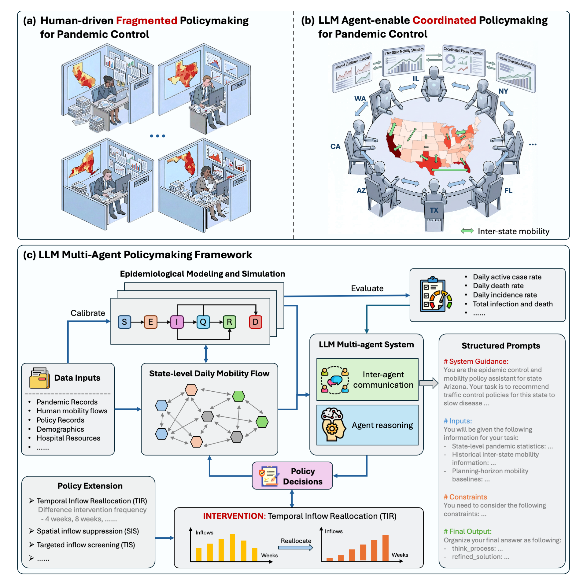

# Coordinated Pandemic Control with LLM Policymaking Assistants

This repository implements a coordinated pandemic control framework where LLMs serve as **policymaking assistants**. Each administrative unit (for example, a county or a state) is instantiated as an autonomous agent, and agents coordinate through communication to regulate inter-region mobility and mitigate disease spread.




## ArXiv
- [https://arxiv.org/abs/2601.09264](https://arxiv.org/abs/2601.09264)

---

## Main Results

### Five-state evaluation
**Cumulative infection**


### Twenty-state evaluation
**Average daily incidence rate**


---

## Repository Structure

### Core modules (`agents/`)
- `configs.py` — Basic runtime configuration and experiment settings  
- `epidemic_model.py` — SEIR-based epidemiological simulator  
- `region_agent.py` — Local policymaking agent (one per administrative unit)  
- `coordinate_agent.py` — Coordination and communication agent  
- `workflow.py` — Main pipeline orchestration  

### Metrics computation
- `main.py` — run the experiment
- `indicator_collect.py` — Compute evaluation indicators (for example, incidence-related metrics)

### Comparison and analysis (`analysis/`)
- `compare_us_1.py` — Temporal indicators for twenty states (incidence rate, active case ratio, death rate)  
- `compare_us_4.py` — Cumulative infection and death across twenty states (TIR, SIS, TIS)  
- `compare_us_4_individual.py` — Cumulative infection and death for each state  
- `calculate_R0.py` — Effective reproduction number calculation  

### Plotting (`plot/`)
- `plot_type_classify.py` — Distribution of policy types (strict-first vs balanced)  
- `plot_type_regression.py` — Shapley-value-based feature attribution analysis  
- `compare_policy_type_2.py` — Five-state comparison under different policy types (total infection and death)  
- `compare_policy_type_3.py` — Reduction–equity trade-off analysis  
- `compare_week.py` — State-level metrics under different policy decision frequencies  
- `compare_week_2.py` — State-level total reduction under different policy decision frequencies  
- `compare_week_4.py` — Aggregate-level total reduction under different policy decision frequencies  
- `SIS_policy_analysis.py` — Target selection behavior under SIS and TIS  
- `compare_rule.py` — Results under different intervention strategies  
- `plot_R0.py` — Visualization of the effective reproduction number  

### Calibration (`calibration/`)
- Stage one: `datasets/fit_serid_initial_2.ipynb`  
- Stage two: `fit_param_v2.py`  

---

## Citation
Please cite our paper if you find this repository useful:

```bibtex
@article{shi2026coordinated,
  title={Coordinated Pandemic Control with Large Language Model Agents as Policymaking Assistants},
  author={Ziyi Shi, Xusen Guo, Hongliang Lu, Mingxing Peng, Haotian Wang, Zheng Zhu, Zhenning Li, Yuxuan Liang, Xinhu Zheng and Hai Yang},
  journal={arXiv preprint arXiv:2601.09264},
  year={2026}
}
```
